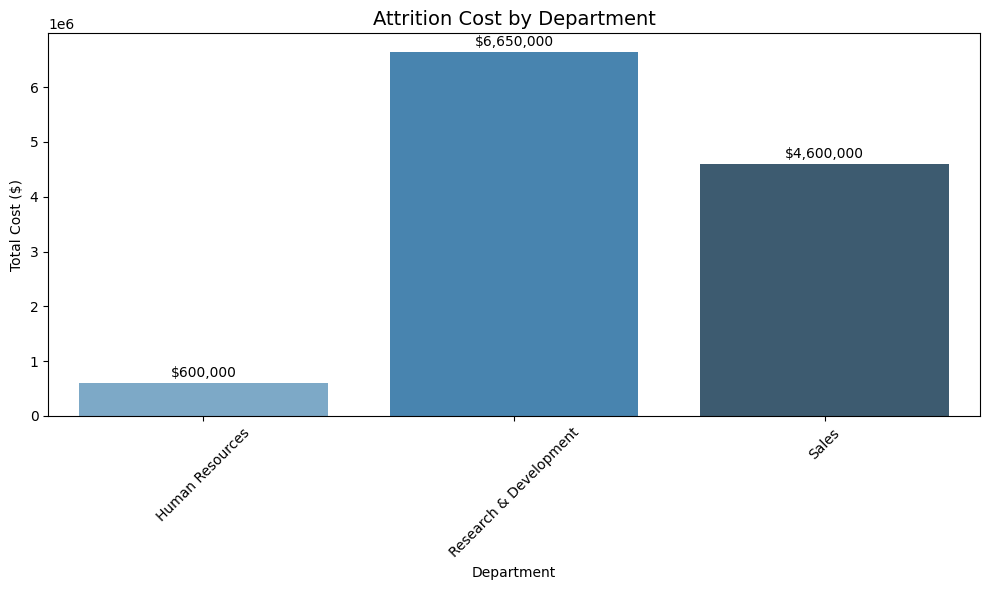
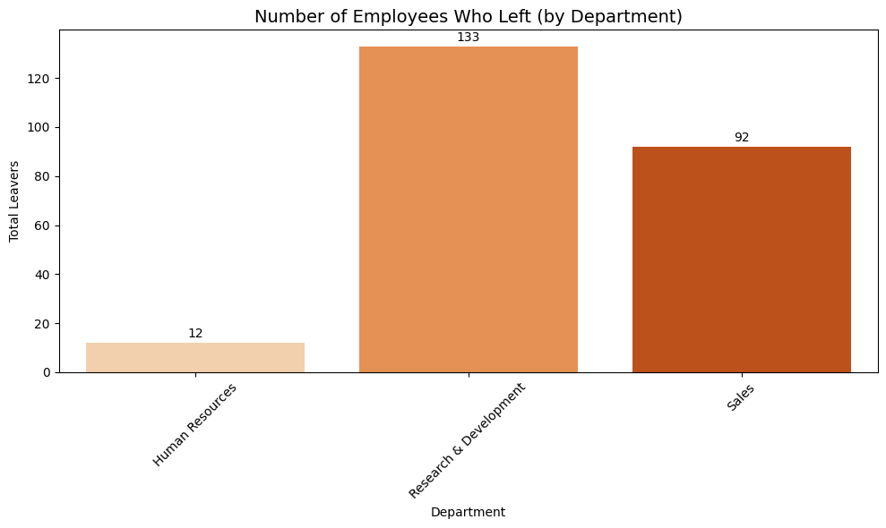
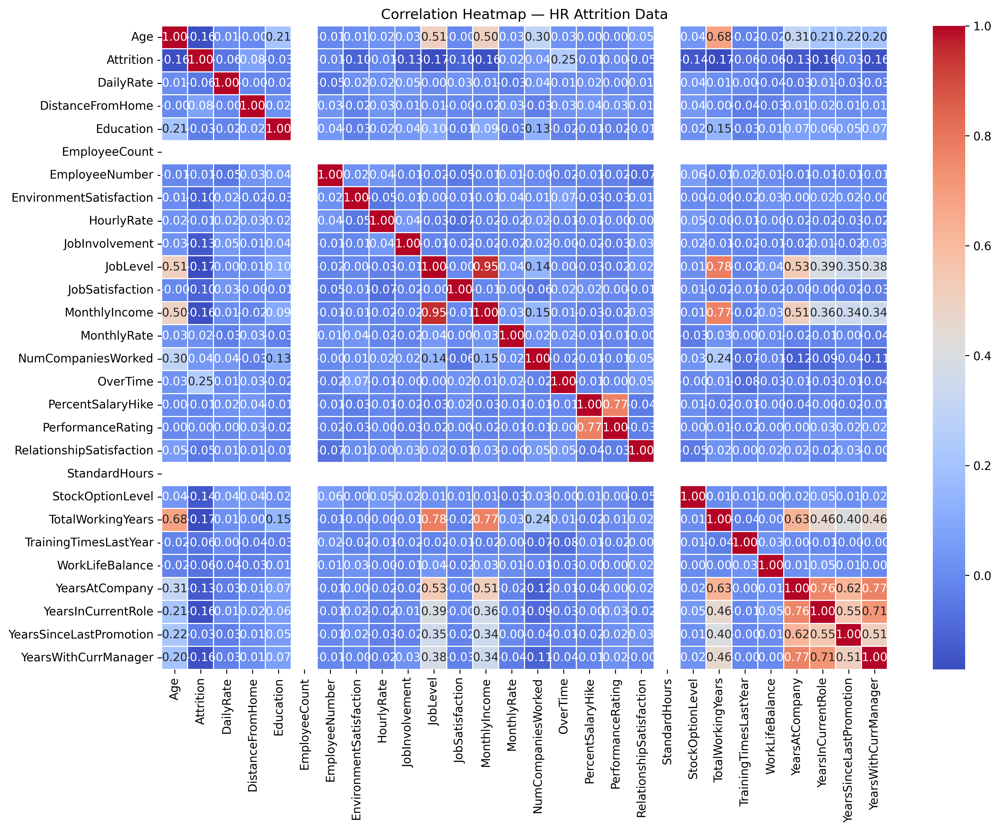

# 📊 HR Attrition Analysis | *evanalytics.Corp*

This project simulates how a Financial Analyst can leverage HR attrition data to support **forecasting**, **cost modeling**, and **retention strategy** — all essential to **modern FP\&A functions**.

---

## 🎯 Objective

To explore how data-driven HR insights can inform financial decisions, we:

* Model the **cost of employee attrition**
* Detect potential **retention bottlenecks**
* Simulate **real-world FP\&A use cases**

---

## 🧪 Hypotheses

1. **Low income**, **frequent overtime**, and **low satisfaction** are predictors of attrition.
2. **Departments with high attrition** also show high **variance in tenure and performance**.
3. **Younger employees** tend to leave earlier, reducing ROI on onboarding.

---

## 🛠️ Tech Stack

| Category      | Tools                                        |
| ------------- | -------------------------------------------- |
| Analysis      | Python (Pandas, Seaborn, Matplotlib, Plotly) |
| Interface     | Jupyter Notebook                             |
| Automation    | Scripts & GitHub                             |
| IDE           | VS Code with Git Bash                        |
| Visualization | Tableau / Power BI (optional)                |

---

## 🗂️ Project Structure

```
HR_analytics_evCorp/
.
├── data
│   └── WA_Fn-UseC_-HR-Employee-Attrition.csv
├── kaggle.json
├── notebooks
│   ├── correlation_heatmap.ipynb
│   ├── explore_dataset.ipynb
│   ├── explore_dataset2.ipynb
│   └── plot_attrition_cost.ipynb
├── outputs
│   ├── attrition_cost_by_department.csv
│   ├── attrition_leavers.csv
│   ├── correlation_heatmap.png
│   ├── percentages_attrition_rate_by_department.png
│   ├── plot_attrition_cost.png
│   ├── plot_Number_of_Employees_Who_Left.png
│   └── share_of_total_attrition_by_department.png
├── README.md
├── requirements.txt
├── scripts
│   ├── analyze_hr_data.py
│   ├── load_kaggle_data.py
│   └── model_attrition_cost.py
├── structure.txt
├── venv
│   ├── bin
│   ├── etc
│   ├── include
│   ├── lib
│   ├── pyvenv.cfg
│   └── share
└── venv310
    ├── etc
    ├── Lib
    ├── pyvenv.cfg
    ├── Scripts
    └── share

16 directories, 21 files
```

---

## 🔍 Attrition Cost Modeling

The script `scripts/model_attrition_cost.py` loads the dataset and calculates financial impact using the following steps:

### What it does:

1. **Loads data** from `/data/WA_Fn-UseC_-HR-Employee-Attrition.csv`
2. Flags records where `Attrition == 'Yes'`
3. Assigns a **fixed cost of \$50,000 per leaver** *(editable in script)*
4. Computes:

   * 🔻 Total number of leavers
   * 💸 Total estimated cost of attrition
   * 🏢 Department-wise cost breakdown
5. Saves results to `/outputs` folder as CSV files
6. Plots a **horizontal bar chart** showing departmental attrition cost

### Output Files:

| File                                       | Description                   |
| ------------------------------------------ | ----------------------------- |
| `outputs/attrition_leavers.csv`            | Records of employees who left |
| `outputs/attrition_cost_by_department.csv` | Cost breakdown per department |

---

## 📊 Sample Insights

---

## 📊 Attrition Cost by Department



## 👥 Total Leavers by Department



---


* Correlation heatmaps revealed patterns in satisfaction, income, and overtime
* Attrition rates were highest in **Sales** and **R\&D**
* Simulated savings by improving retention in high-cost departments


Explanation of Correlation Heatmap 

---

## 📊 What You’re Seeing

This is a **correlation matrix heatmap**, where:

* Each square represents the **correlation** between two variables.
* Values range from:

  * `+1.00`: **Perfect positive** correlation (when one goes up, so does the other)
  * `0.00`: **No correlation**
  * `-1.00`: **Perfect negative** correlation (when one goes up, the other goes down)
* Colors:

  * 🔴 **Redder** = stronger correlation (positive or negative)
  * 🔵 **Bluer** = weaker or no correlation

---

## 🔎 Focus: Correlation with `Attrition`

You want to understand what variables are **related to employee attrition** — so let's read across the `Attrition` row:

| Variable            | Correlation | Meaning                                                           |
| ------------------- | ----------- | ----------------------------------------------------------------- |
| `OverTime`          | **+0.25**   | Strongest positive — more overtime → higher chance of attrition ✅ |
| `MonthlyIncome`     | **-0.16**   | Negative — lower income → higher chance of leaving                |
| `JobLevel`          | **-0.17**   | Lower job level → more likely to leave                            |
| `TotalWorkingYears` | **-0.17**   | Fewer working years → more likely to leave                        |
| `Age`               | **-0.16**   | Younger employees are more likely to leave                        |
| `YearsAtCompany`    | **-0.13**   | Less time at company → higher attrition risk                      |

Everything else is near **0.00**, so weak or no relationship.


## ✅ Most Insightful Patterns

### 1. **OverTime is the most powerful predictor**

* Correlation = `+0.25`
* Suggests employees working overtime are **more likely to quit** (burnout risk)

### 2. **Lower MonthlyIncome, Lower JobLevel, Younger Age**

* All have **negative correlations** with attrition
* Suggests people leave when they:

  * Feel underpaid
  * Are in junior roles
  * Are early in their career

### 3. **Tenure indicators matter**

* `YearsAtCompany`, `TotalWorkingYears`: negative correlation
* Less experience → more likely to leave (possibly due to unmet expectations or lack of fit)


## ⚠️ Caution

* These are **correlations**, not causation.
* Just because `OverTime` is positively correlated with `Attrition` doesn’t **prove** it causes attrition, but it's a strong signal.


## 💡 Business Value

* Helps HR & Finance **align on cost-saving goals**
* Aids in **budgeting** and **strategic workforce planning**
* Demonstrates how **analytics supports cost control**


